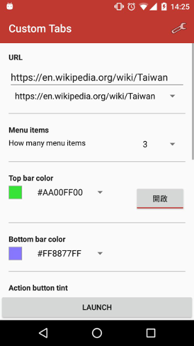

# Introduction

This is a simple Andorid app to test [Custom tabs](https://developer.chrome.com/multidevice/android/customtabs). All it does is just launch an CustomTabsIntent.



# Build

just like normal Android app.

```bash
./gradlew build
```

# License

Mozilla Public License, v. 2.0. you can obtain a copy at [http://mozilla.org/MPL/2.0/](http://mozilla.org/MPL/2.0/)

